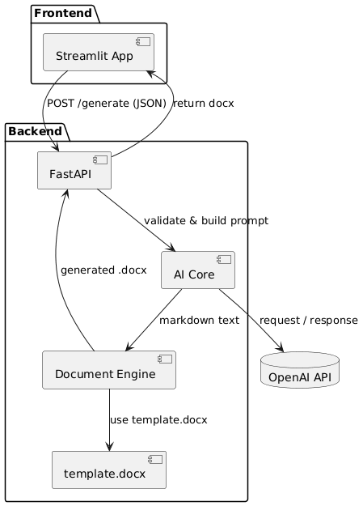
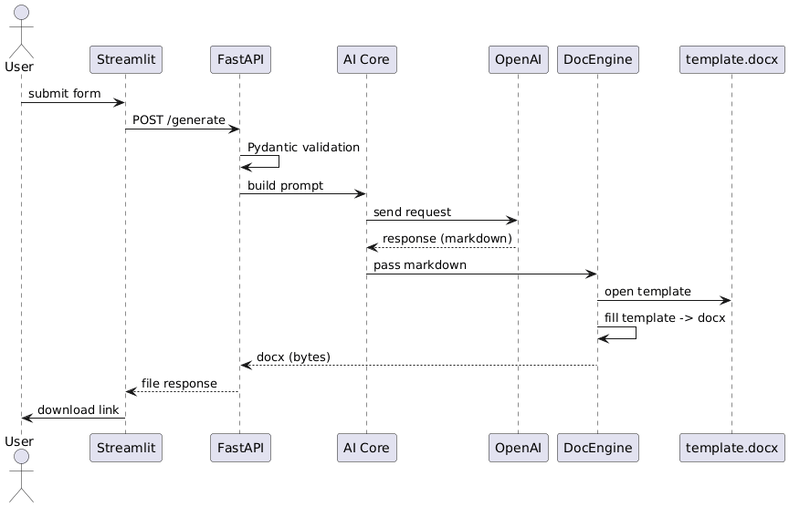

# Ai-sales-proposal-generator

Automate the creation of structured commercial proposals (DOCX) from short briefs using an LLM + python-docx pipeline.

---

## Table of contents

* [Overview](#overview)
* [Architecture](#architecture)
* [Quick start (local)](#quick-start-local)
* [Environment & secrets](#environment--secrets)
* [Run the apps (dev)](#run-the-apps-dev)
* [API & data contract](#api--data-contract)
* [Prompt tones: Formal vs Marketing (guidance for LLM prompts)](#prompt-tones-formal-vs-marketing-guidance-for-llm-prompts)
* [DOCX template rules & mapping LLM -> DOCX](#docx-template-rules--mapping-llm---docx)
* [Docker / Production demo](#docker--production-demo)
* [Testing & QA](#testing--qa)
* [CI/CD, Logging & Governance](#cicd-logging--governance)
* [Troubleshooting](#troubleshooting)
* [Contributing](#contributing)

---

## Overview

This project contains:

* `frontend/` - Streamlit app (user form → sends request to backend).
* `backend/` - FastAPI app (validates request, calls OpenAI, builds DOCX using python-docx and returns file).
* `template.docx` (expected in repository or `backend/templates`) - the DOCX template used by the doc generator.
* `docker-compose.yml` - dev demo orchestration.
* `payload.json` - example request payload.
* `requirements.txt` - Python dependencies.

The goal: generate a well-structured, styled proposal DOCX from a short user brief and tone selection.

---


## Architecture Diagram



**Main Components:**

- **User** – fills out the form in the browser and clicks “Generate”.
- **Streamlit (Frontend)** – simple web app; sends requests to backend and receives the file. It’s the only entry point from the user’s perspective.
- **FastAPI (Backend / API)** – receives POST requests, validates input (Pydantic), coordinates AI Core and Document Engine, returns the final DOCX file.
- **AI Core** – generates prompts based on form data and selected options (tone, audience, structure), sends request to OpenAI, receives structured text (Markdown or similar).
- **OpenAI API** – cloud service that returns generated text.
- **Document Engine (python-docx)** – parses Markdown text, applies styles, inserts into `template.docx`, produces the final DOCX file in memory (BytesIO).
- **template.docx** – DOCX template with pre-defined styles (Heading 1/2), logo in headers, placeholders (e.g., `{{title}}`, `{{sections}}`).


## Sequence Diagram



**Step-by-Step Flow:**

1. **User → Streamlit:** fills in fields (company name, contact, requirements, tone) and clicks “Generate”.
2. **Streamlit → FastAPI (POST /generate, JSON body):**
```json
{
  "client_name": "Example Corp",
  "project_goal": "Automate proposal generation",
  "scope": "...",
  "technologies": ["Python", "FastAPI", "OpenAI"],
  "deadline": "2025-10-31",
  "tone": "Formal"
}
````

3. **FastAPI → AI Core:** constructs the prompt and sends it to OpenAI.
4. **AI Core → OpenAI API:** receives generated text.
5. **FastAPI → Document Engine:** parses text and generates DOCX.
6. **Document Engine → FastAPI:** returns the completed file.
7. **FastAPI → Streamlit:** sends the final DOCX back to the user for download.


**Main flow:**
`Streamlit (UI)` → `FastAPI (Backend)` → `OpenAI (LLM)` → `FastAPI (Doc generator)` → `Streamlit (Download)`

Open API docs (Swagger UI): `http://127.0.0.1:8000/docs#/default/generate_proposal_api_v1_generate_proposal_post`

---

## Quick start (local)

> These steps produce a local development environment. Replace placeholders with your own values. **Do not** put secrets in the Git repo.

1. Clone

```bash
git clone https://github.com/statven/Ai-sales-proposal-generator.git
cd Ai-sales-proposal-generator
```

2. Create & activate a Python virtual environment

```bash
python -m venv .venv
# macOS / Linux
source .venv/bin/activate
# Windows PowerShell
.venv\Scripts\Activate.ps1
```

3. Install dependencies

```bash
pip install -r requirements.txt
```

4. Create env file from the example and edit

```bash
cp .env.example .env
# Edit .env to set OPENAI_API_KEY and any other variables
```

### Setting your OpenAI key (safe examples)

**Do NOT** paste a real key into files you commit. Use local env or secrets manager.

PowerShell (temporary for session):

```powershell
$env:OPENAI_API_KEY = "sk-REPLACE_WITH_YOUR_KEY"
```

PowerShell (persist via setx - requires reopening shell for the change to take effect):

```powershell
setx OPENAI_API_KEY "sk-REPLACE_WITH_YOUR_KEY"
```

macOS / Linux:

```bash
export OPENAI_API_KEY="sk-REPLACE_WITH_YOUR_KEY"
```

Or put in `.env` (recommended for local dev; **never** commit `.env`):

```
OPENAI_API_KEY=sk-REPLACE_WITH_YOUR_KEY
API_HOST=127.0.0.1
API_PORT=8000
```

---

## Run the apps (dev)

### Backend (FastAPI)

From project root:

```bash
cd backend
# Recommended: run uvicorn from inside backend
# if the ASGI app is `main:app` (common), use:
uvicorn main:app --reload --host 127.0.0.1 --port 8000
```

If the main module is named differently (e.g., `app.py`) then use `uvicorn app:app --reload ...`. The swagger UI will be at `http://127.0.0.1:8000/docs`.

### Frontend (Streamlit)

From project root:

```bash
cd frontend
# run the Streamlit app file - replace `app.py` with actual filename if different
streamlit run app.py --server.port 8501
# then open http://localhost:8501
```

### Full dev flow

1. Start backend (uvicorn)
2. Start frontend (streamlit)
3. Use the Streamlit form to create a brief and click *Generate*, or call the API directly via Swagger or curl.

---

## API & data contract

**Swagger**: `http://127.0.0.1:8000/docs#/default/generate_proposal_api_v1_generate_proposal_post`

> The repository contains `payload.json` - an example body. Below is a canonical JSON schema / contract that the frontend sends to the backend.

### Frontend → Backend JSON schema (recommended)

```json
{
  "type": "object",
  "required": ["client_name","project_goal","scope","tone"],
  "properties": {
    "client_name": {"type": "string", "minLength": 1, "maxLength": 120},
    "project_goal": {"type": "string", "minLength": 1, "maxLength": 2000},
    "scope": {"type": "string", "minLength": 1, "maxLength": 5000},
    "technologies": {"type": "array", "items": {"type": "string"}},
    "deadline": {"type": "string", "format": "date", "nullable": true},
    "tone": {"type": "string", "enum": ["Formal","Marketing"]},
    "audience": {"type": "string", "maxLength": 200, "nullable": true},
    "contact_email": {"type": "string", "format": "email", "nullable": true},
    "additional_notes": {"type": "string", "maxLength": 4000, "nullable": true}
  }
}
```

### Example payload

```json
{
  "client_name": "Example Corp",
  "project_goal": "Automate proposal generation",
  "scope": "Design, implementation and handover of a proposal generation service...",
  "technologies": ["Python","FastAPI","Streamlit","OpenAI"],
  "deadline": "2025-10-31",
  "tone": "Formal",
  "audience": "Procurement team",
  "contact_email": "poc@example.com"
}
```

### Responses

* **Success (200)**: returns a `application/vnd.openxmlformats-officedocument.wordprocessingml.document` file stream with `Content-Disposition: attachment; filename="Proposal_<CLIENT_NAME>.docx"`.
* **Failure (4xx / 5xx)**: returns JSON `{ "error": "<human readable message>", "code": "<internal_code>" }`. The backend should log implementation details server-side but return minimal safe messages to the client.

---

## Prompt tones: Formal vs Marketing (guidance for LLM prompts)

When constructing prompts programmatically, keep a deterministic template + small style variations.

**Formal tone** (when target = procurement, technical audience):

* Structure: Executive Summary → Objectives → Scope → Deliverables → Timeline → Pricing → Terms.
* Language: precise, concise, neutral; avoid hyperbole; use passive voice rarely.
* Sentences: medium length, professional vocabulary, evidence-based claims.
* Formatting: explicit headings, numbered lists for milestones, tables for costs.

**Marketing tone** (when target = decision maker, business sponsor):

* Structure: Hook (pain/benefit) → Value proposition → Key features → Outcomes → Case studies → CTA.
* Language: persuasive, benefit-driven, shorter sentences, active voice.
* Voice: highlight outcomes, ROI, differentiation; judicious use of rhetorical questions.
* Formatting: bold summaries, bullet lists with benefits first, short customer-centric examples.

**Implementation tip**: your prompt template should be split into:

1. System / instruction block that enforces the structure and style (tone).
2. Dynamic block that injects `client_name`, `goal`, `scope`, `deadline`, `audience`.
3. Output schema directive: request Markdown/Markdown-like sections using `##` for headings and `-` for bullets so the doc parser can reliably convert to DOCX.

Example instruction appended to prompt:

```
Produce a structured proposal in Markdown. Use "##" for section headings and "-" for bullets. Follow this top-level structure: Executive Summary; Objectives; Scope; Deliverables; Timeline; Pricing; Conclusion. Write in a Formal style: concise, evidence-based sentences. Output only the proposal text (no metadata).
```

---

## DOCX template rules & mapping LLM → DOCX

**Template (`template.docx`)**:

* Define Word styles for:

  * `Heading 1` → Title sections (font size e.g., 18–22pt).
  * `Heading 2` → Subsection titles (14–16pt).
  * `Normal` → Body text (11–12pt, line-height 1.15).
  * `List Bullet` → bullet points.
* Add placeholders: `{{CLIENT_NAME}}`, `{{DATE}}`, `{{TITLE}}` in header or cover page.
* Add a logo placeholder in header/footer (inserting an empty image frame or note).
* Branding assets (fonts/colors) added to template where possible.

**Mapping rules (LLM output → python-docx)**:

* `## <Heading>` → apply `Heading 1`.
* `### <Subheading>` → apply `Heading 2`.
* `- <item>` (consecutive) → create a Word bullet list using `List Bullet` style.
* Numbered lists in Markdown (`1. `) → Word numbered list.
* Tables (if LLM outputs a simple pipe `|` table) → parse rows and create `docx` table.
* Inline emphasis (e.g., `**bold**` or `_italic_`) → map to Word bold/italic runs if parser supports.
* If the LLM produces complex HTML or custom tags, sanitize and fallback to plain text paragraph.

**Complex elements**:

* For advanced tables or cost tables, ask LLM to emit a simple JSON table block for reliable parsing:

```json
{"table":"costs","columns":["Item","Qty","Unit Price","Total"], "rows":[["Design",1,5000,5000]]}
```

* Document generator should check for JSON blocks first (safer) before parsing Markdown tables.

**Filename convention**:
`Proposal_<CLIENT_NAME>_<YYYYMMDD>.docx` (e.g., `Proposal_ExampleCorp_20251027.docx`).

---


## Appendix - Example commands (local workflow)

```bash
# clone
git clone https://github.com/statven/Ai-sales-proposal-generator.git
cd Ai-sales-proposal-generator

# Create venv & install
python -m venv .venv
source .venv/bin/activate   # or .venv\Scripts\Activate.ps1 on Windows (PowerShell)
pip install -r requirements.txt

# set OPENAI key for current PowerShell session (example - replace the value)
# PowerShell (session only) - do NOT commit this
$env:OPENAI_API_KEY = "sk-REPLACE_WITH_YOUR_KEY"

# backend (from repo root)
cd backend
uvicorn main:app --reload --host 127.0.0.1 --port 8000

# frontend (in new shell)
cd frontend
streamlit run app.py --server.port 8501
```


