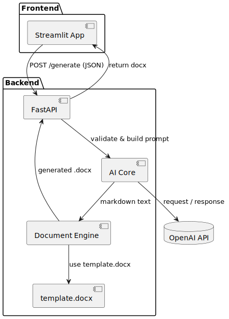

# AI Sales Proposal Generator — Architecture & Workflow

## Component Diagram (Architecture)



**Main Components:**

- **User** – The person using a browser, filling out the form, and clicking “Generate”.
- **Streamlit (Frontend)** – Simple web app with the input form; sends requests to backend and receives the file for download. This is the only entry point from the user's perspective.
- **FastAPI (Backend / API)** – HTTP server handling POST requests from Streamlit (e.g., `/generate`). Responsible for:
  - Input validation (Pydantic)
  - Coordinating AI Core and Document Engine
  - Returning the final DOCX file to the client
- **AI Core** – Forms prompts based on form data and options (tone, audience, structure). Sends requests to OpenAI and receives structured text (Markdown or similar).
- **OpenAI API** – Cloud service; returns generated text. Needs handling of network timeouts and token quotas.
- **Document Engine (python-docx)** – Takes `template.docx` and inserts generated text (parsing Markdown → styled DOCX, mapping headings, paragraphs, lists, tables). Produces final DOCX in memory (BytesIO).
- **template.docx** – DOCX template with predefined styles (Heading 1/2), logo in headers/footers, placeholders (e.g., `{{title}}`, `{{sections}}`).

> Modular separation between AI Core and Document Engine allows changing LLM provider, template, or conversion logic without touching the UI.

---

## Sequence Diagram (Step-by-Step Flow)


**Step-by-Step Flow:**

1. **User → Streamlit:** fills in fields (company name, contact, requirements, tone, etc.) and clicks “Generate”.
2. **Streamlit → FastAPI (POST /generate, JSON body):**
```json
{
  "client_name": "Example Corp",
  "project_goal": "Automate proposal generation",
  "scope": "...",
  "technologies": ["Python", "FastAPI", "OpenAI"],
  "deadline": "2025-10-31",
  "tone": "Formal"
}
````

3. **FastAPI → AI Core:** builds the prompt and sends it to OpenAI.
4. **AI Core → OpenAI API:** receives the generated structured text.
5. **FastAPI → Document Engine:** parses the text and generates DOCX.
6. **Document Engine → FastAPI:** returns the final DOCX file.
7. **FastAPI → Streamlit:** returns the DOCX for the user to download.

